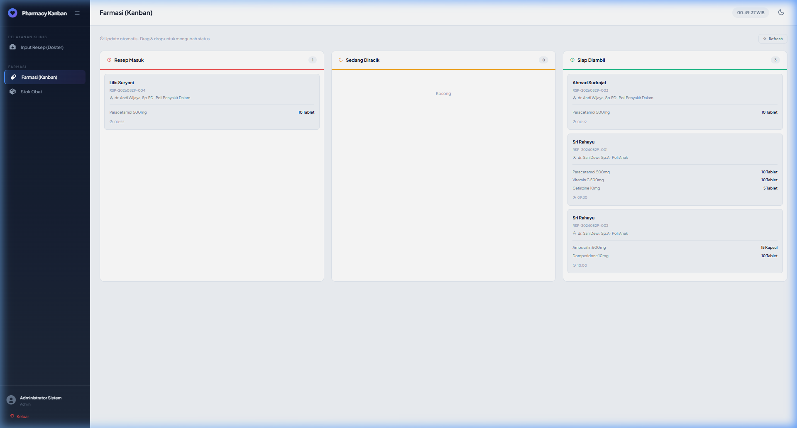
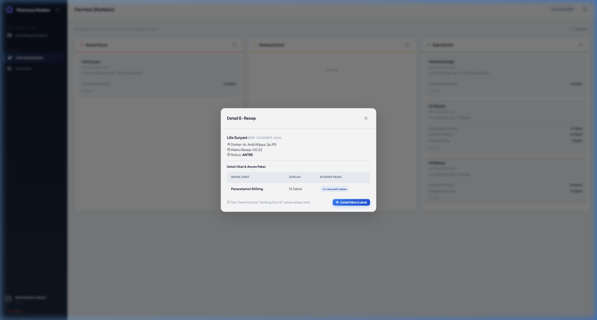
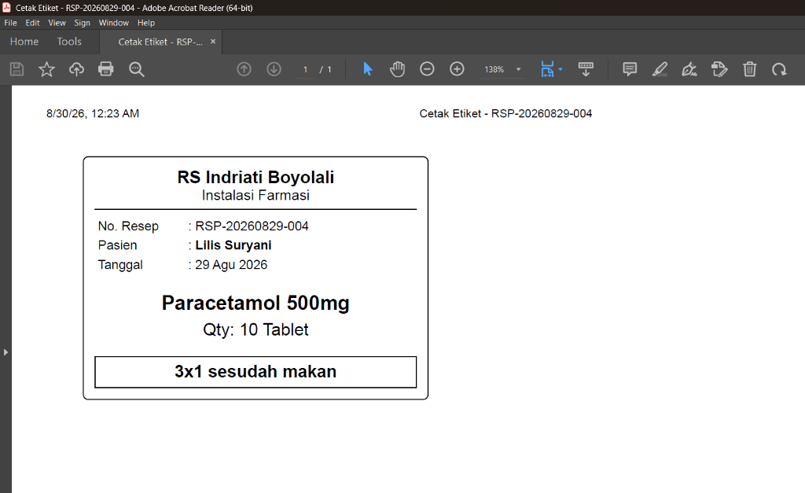
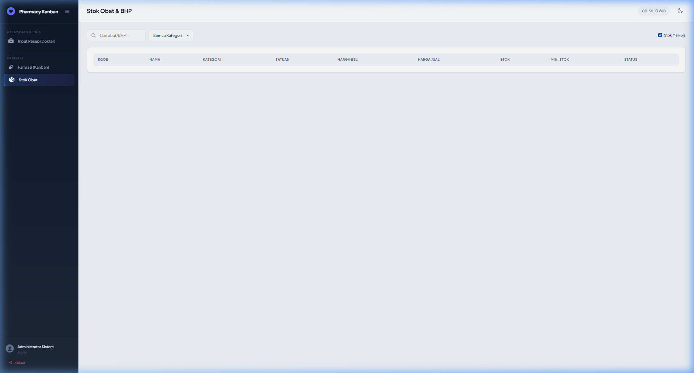
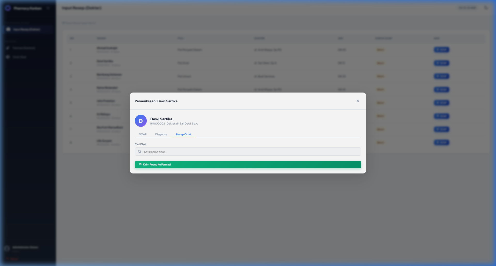

# 🏥 Pharmacy Kanban (SIMRS Khanza Modernization)

**Hackathon Hilirisasi Vol. 5 Submission**

## 💡 Latar Belakang (The Problem)
Sistem Informasi Manajemen Rumah Sakit (SIMRS) tradisional seperti SIMRS Khanza memiliki fondasi database yang sangat kuat dan lengkap. Namun, dari segi *User Experience* (UX), sistem *legacy* seringkali lambat, kaku, dan membanjiri pengguna dengan ratusan menu yang tidak relevan dengan tugas harian mereka.

Berdasarkan studi kasus dari Bapak Abdul Rokhim (IT Manager RS), membangun ulang sebuah sistem rumah sakit secara keseluruhan dari nol dalam waktu singkat adalah **mustahil dan tidak strategis**. Tim yang mencoba membangun "sedikit dari segalanya" akan menghasilkan sistem yang dangkal dan gagal di-adopsi oleh staf rumah sakit.

## 🚀 Ide Penyelesaian (The Solution)
Alih-alih merombak seluruh rumah sakit, proyek ini mengambil pendekatan **Laser-Focused**: menyelesaikan satu *pain point* paling kritis secara mendalam, yaitu **Alur Pelayanan Resep di Instalasi Farmasi (Apotek)**.

Kami menghadirkan **Pharmacy Kanban**: Sebuah antarmuka web modern yang sangat spesifik, *user-friendly*, namun 100% kompatibel dan terintegrasi dengan struktur database *legacy* SIMRS Khanza di belakang layar.

## ✨ Fitur Unggulan

1. **Papan Kanban Interaktif (Drag & Drop)**
   Apoteker tidak perlu lagi menyegarkan (refresh) tabel kaku berkali-kali. Antrean resep tampil dalam bentuk kartu-kartu visual. Cukup **seret (drag)** kartu dari "Resep Masuk" ke "Sedang Diracik", dan status database akan otomatis diperbarui.
   
   

2. **Validasi Stok Pintar (Real-time)**
   Saat kartu diseret ke tahap "Diracik", sistem secara asinkron memvalidasi ketersediaan obat. Jika stok di gudang tidak mencukupi, kartu akan dikembalikan ke posisi semula dengan peringatan, mencegah kesalahan pemberian obat.

3. **Cetak Etiket (Labeling) Satu Klik**
   Sangat sesuai dengan alur kerja nyata di RS: Apoteker dapat mengeklik detail kartu dan mencetak **Etiket Aturan Pakai** yang siap ditempel pada plastik obat, meniru alur krusial yang ada di Khanza.
   
   
   *Hasil cetak (PDF preview):*
   

4. **Peringatan Stok Kritis (Low Stock Indicator)**
   Tabel stok memisahkan fungsi gudang dari pelayanan, dilengkapi filter indikator merah "Stok Menipis" otomatis, mempermudah pengadaan obat baru (purchase order).
   
   

5. **End-to-End Simulation (Dokter -> Farmasi)**
   Aplikasi ini tidak berdiri sendiri. Dilengkapi dengan modul simulasi **Input Resep (Dokter)**, di mana dokter di rawat inap/jalan dapat menginput hasil pemeriksaan (SOAP) dan e-Resep. Begitu tombol "Kirim Resep" diklik dokter, kartu seketika muncul di Papan Kanban apoteker.
   
   

## 🛠️ Tech Stack
- **Frontend:** Vanilla JavaScript (ES6+), HTML5, CSS3, Tailwind CSS (via CDN), Sortable.js (untuk drag-and-drop Kanban).
- **Backend:** Node.js, Express.js.
- **Database:** MySQL (Skema kompatibel dengan filosofi SIMRS).

## 🏃‍♂️ Cara Menjalankan (Bagi Juri)

1. **Instalasi Dependencies**
   Pastikan Anda berada di root folder proyek, kemudian jalankan:
   ```bash
   npm install
   ```

2. **Setup Database**
   Pastikan service MySQL Anda berjalan (misal via XAMPP). Kemudian jalankan:
   ```bash
   npm run setup-db
   ```
   *(Perintah ini akan membuat database `simrs_kanban`, tabel-tabel, dan mengisi data dummy obat & pasien).*

3. **Jalankan Server**
   ```bash
   npm run dev
   ```
   Aplikasi akan berjalan di `http://localhost:3000`.

4. **Pengujian Simulasi (Demo Workflow)**
   - Login menggunakan kredensial (misal: `admin` / `admin123`).
   - Bertindak sebagai **Dokter**: Buka menu **Input Resep (Dokter)**, klik tombol **SOAP** pada pasien, pilih tab **Resep Obat**, input obat dan klik Kirim Resep.
   - Bertindak sebagai **Apoteker**: Buka menu **Farmasi (Kanban)**. Temukan resep yang baru dikirim di kolom "Resep Masuk". Klik kartu tersebut, cetak etiket, dan *drag* kartu ke kolom "Sedang Diracik". 

---
*Dibuat untuk Hackathon Hilirisasi — "A focused, working solution to one clearly chosen problem beats a sprawling attempt."*
